# 시스템 아키텍처 다이어그램 모음

## 📋 개요

본 문서는 법률 AI 어시스턴트 시스템의 주요 아키텍처와 데이터 플로우를 시각적으로 표현한 다이어그램들을 정리한 문서입니다.

---

## 🏗️ 전체 시스템 아키텍처 다이어그램

### 1. 컴포넌트 구조도

```mermaid
graph TB
    subgraph "Frontend Layer"
        A[Streamlit App<br/>main.py] --> B[Document Search Tab]
        A --> C[Document Analysis Tab]
        A --> D[Legal Q&A Tab]
        A --> E[System Status Tab]
    end

    subgraph "Workflow Layer - LangGraph"
        F[Legal Workflow<br/>legal_workflow.py] --> G[Retrieval Node<br/>retrieval.py]
        F --> H[Analysis Node<br/>analysis.py]
        
        G --> I[PostgreSQL Search]
        G --> J[Vector Search]
        G --> K[Hybrid Results]
        G --> L[Reranking]
        
        H --> M[Summary Extraction]
        H --> N[Key Points]
        H --> O[Legal Issues]
        H --> P[Entity Extraction]
        H --> Q[Risk Assessment]
    end

    subgraph "State Management"
        R[LegalWorkflowState<br/>legal_workflow_state.py]
        S[RetrievalState]
        T[AnalysisState]
    end

    subgraph "Core Services"
        U[SQLite Manager<br/>sqlite.py] --> V[(SQLite DB)]
        W[Vector Store Manager<br/>vector_store.py] --> X[(ChromaDB)]
        Y[OpenAI Client<br/>openai_client.py]
        Z[Clova Client<br/>clova_client.py]
        AA[KURE Embeddings<br/>kure_embeddings.py]
    end

    subgraph "Data Models"
        BB[Legal Document<br/>simple_models.py]
        CC[Legal Document ORM]
    end

    %% Connections
    A --> F
    F --> R
    G --> S
    H --> T
    
    G --> U
    G --> W
    H --> Y
    H --> Z
    W --> AA
    
    U --> BB
    U --> CC
    
    I --> V
    J --> X
```

### 2. 시퀀스 다이어그램 - 사용자 요청 처리 흐름

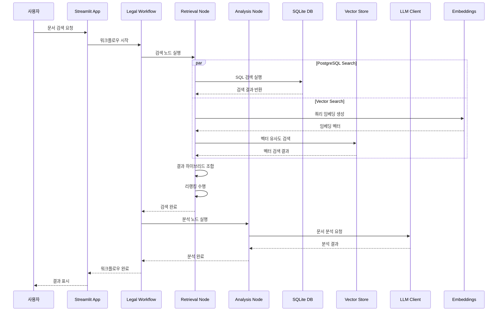

### 3. 데이터 플로우 다이어그램

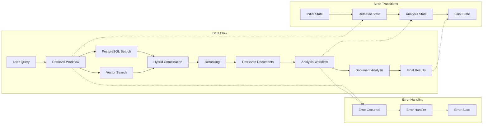

---

## 🔄 LangGraph 워크플로우 상세 다이어그램

### 1. 검색 워크플로우 (Retrieval Workflow)

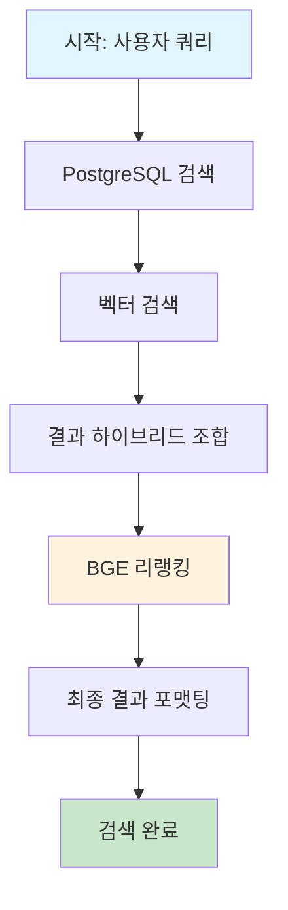

### 2. 분석 워크플로우 (Analysis Workflow)

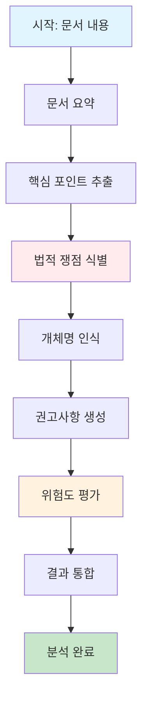

### 3. 조건부 워크플로우

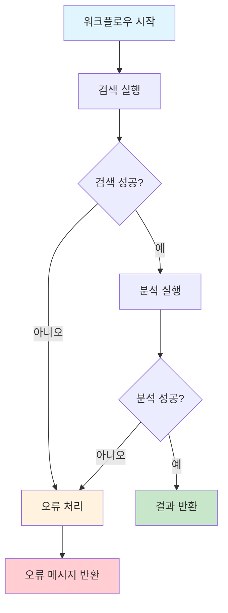

---

## 🗄️ 데이터베이스 아키텍처

### 1. 데이터 저장소 구조

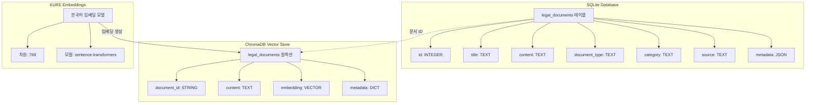

### 2. 검색 프로세스

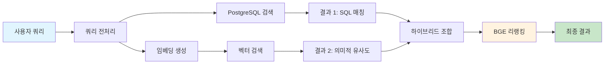

---

## 🧠 LLM 클라이언트 아키텍처

### 1. Multi-LLM 지원 구조

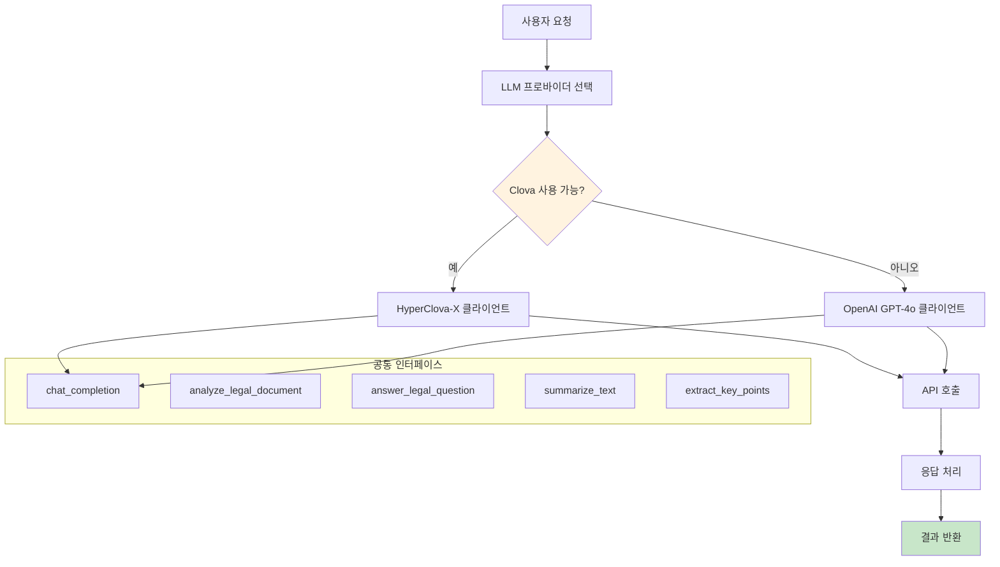

### 2. 프롬프트 처리 흐름

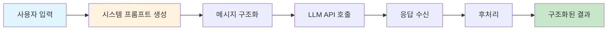

---

## 🎨 Streamlit UI 아키텍처

### 1. 앱 구조

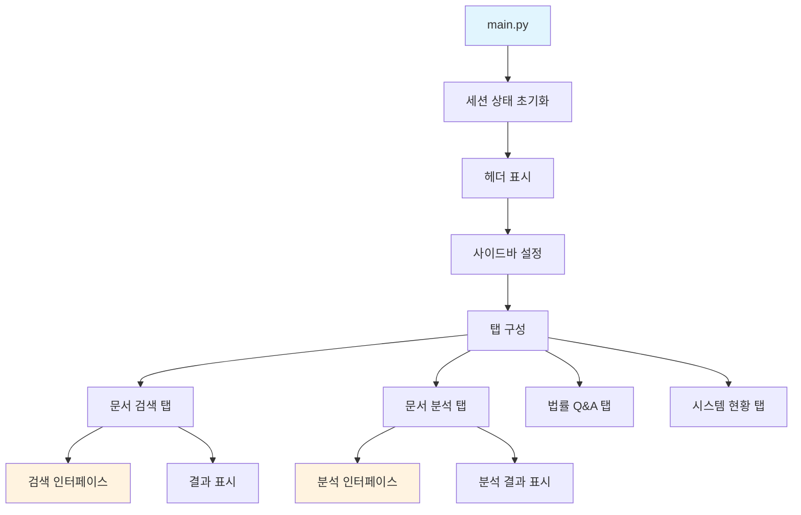

### 2. 상태 관리

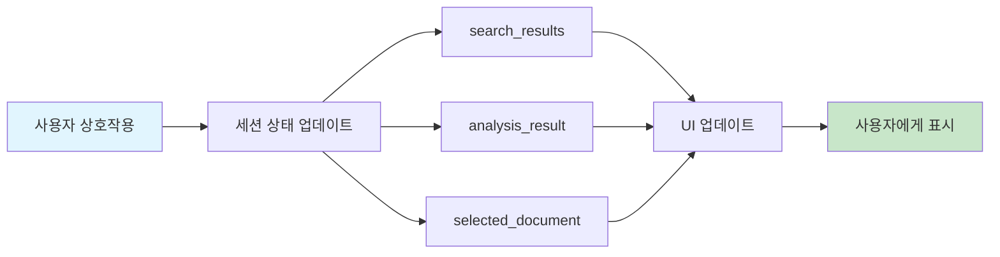

---

## ⚡ 성능 및 확장성 다이어그램

### 1. 현재 성능 병목점

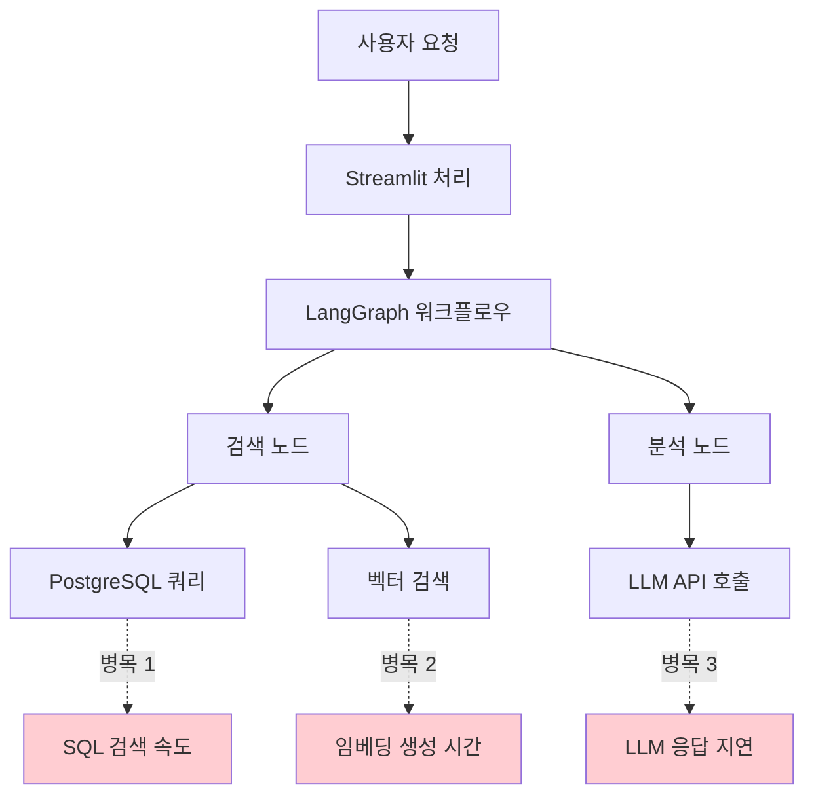

### 2. 최적화된 아키텍처 (Future)

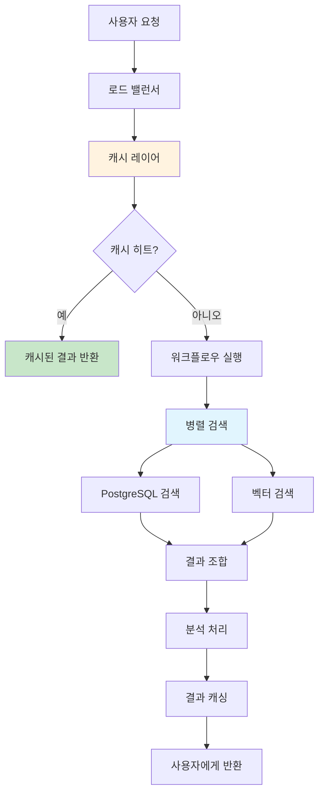

---

## 🔐 보안 아키텍처

### 1. 보안 계층

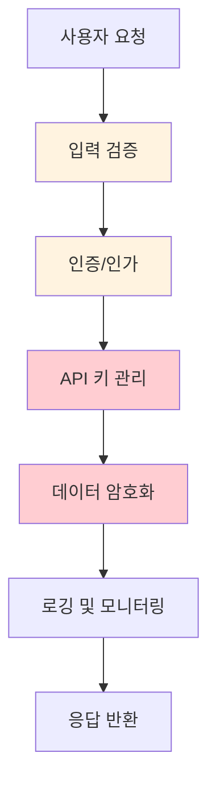

### 2. 데이터 보호

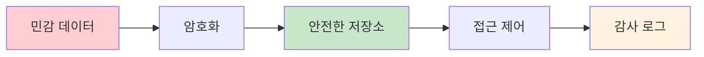

---

## 📊 모니터링 및 로깅

### 1. 모니터링 아키텍처

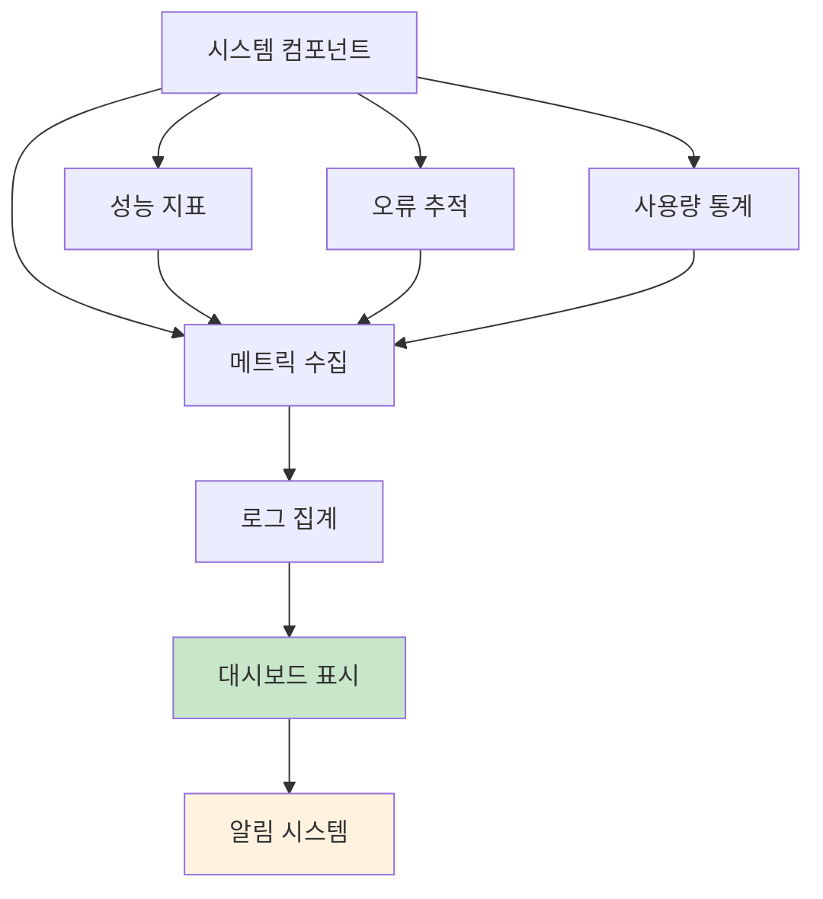

### 2. 로그 플로우

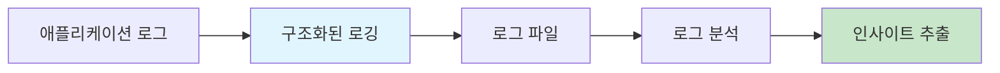

---

## 📋 결론

본 다이어그램 모음은 법률 AI 어시스턴트 시스템의 전체적인 구조와 데이터 흐름을 시각적으로 표현하여 시스템 이해도를 높이고, 향후 개발 및 유지보수에 참고할 수 있는 자료로 활용할 수 있습니다.

각 다이어그램은 시스템의 다른 관점에서의 구조를 보여주며, 전체적인 아키텍처 설계의 일관성과 각 컴포넌트 간의 관계를 명확히 보여줍니다.

---

**작성자**: AI Assistant  
**작성일**: 2024년 12월 26일 